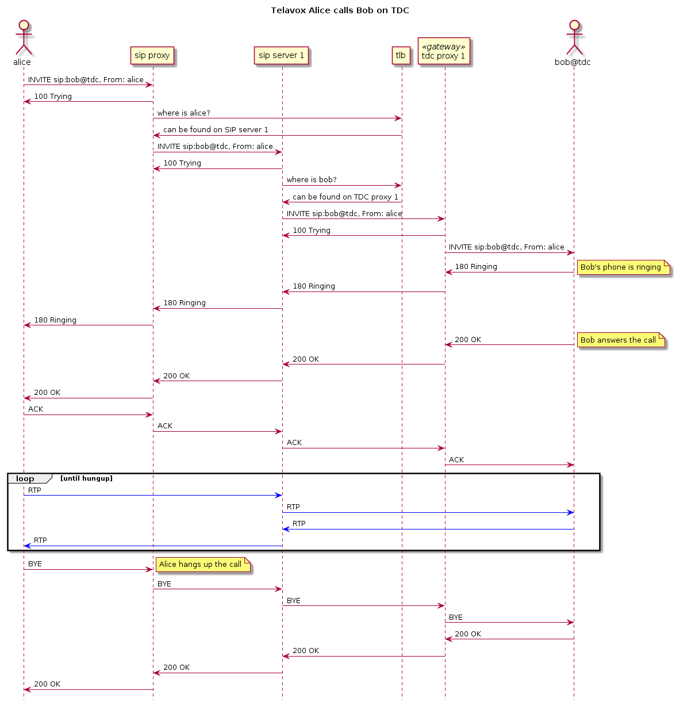

# The telephony platform

## Terminology

| Term             | Description                                                                                      |
|------------------|--------------------------------------------------------------------------------------------------|
| base application |                                                                                                  |
| baseman          |                                                                                                  |
| configurator     |                                                                                                  |
| desktop app      | Desktop softphone application                                                                    |
| gateway          | Joins two different networks                                                                     |
| SIP proxy        | Intermediate entity acting both server and client.<br>Plays a role in routing and load balancing |
| SIP server       | Manages call sessions between multiple endpoints                                                 |
| tlb              | Load balancer for SIP calls.<b>Determines how calls are routed through the telephony platform    |
| top              | Tracks the real-time state of different SIP calls                                                |
| ttps             | Provisioning server used to configure SIP phones                                                 |


## A bird's-eye view

The figure below visualizes the main components involved routing calls.

```
<<provisioner>>        <<load balancer>>
   +------+                +-----+
   | ttps |          ------| tlb |
   +------+          |     +-----+
       |             |
       |             |
   ____|___          |          <<SIP server>>   <<edge gateway>>      __   _
  (_]----[_)    +----------+       +-----+         +---------+       _(  )_( )_
    |.''.|------| sipproxy |-------| sip |---------| gateway |------(_ cloud  _)
    |'..'|      +----------+       +-----+         +---------+        (_) (__)
    '----'                           | |
                              -------- ----------
                              |                 |
   +-------------+         +-----+         +----------+
   | desktop app |---------| top |         | userdata | <<registrar>>
   +-------------+         +-----+         +----------+

```
*Figure 1. Main call routing components*

## Proxies everywhere

Due to some legacy naming convention the name `proxy` turns up in multiple areas.

E.g. the `sipproxy1` sends traffic to the SIP server `sip42` (composed of
`tproxy`) which in turn might relay the traffic to a gateway like `tdcproxy1`:

```
                         <<SIP server>>
        <<proxy>>         +---------+        <<gateway>>
      +-----------+       | [proxy] |       +-----------+
      | sipproxy1 |       |         |       | tdcproxy1 |
      +-----------+       |  sip42  |       +-----------+
                          +---------+
```
*Figure 2. Proxies everywhere*


* The `sipproxy1` is a third-party component ([Kamailio](https://www.kamailio.org))
used during call setup
* The `proxy`, which is a component of the SIP server (`sip42` in the figure
above), was initially created for the gateway. This mean that the `proxy` and
the gateway  are built form the same project, i.e.
[Telavox/proxy](https://github.com/Telavox/proxy)
* The `tdcproxy1` is in this case the gateway to the TDC network.


## The SIP server

The SIP server is the central part in our IP media network. It handles the SIP
sessions between endpoints, the RTP media routing and the SIP registrar (the
registrar itself is located outside the SIP server).

The SIP server is made up of the following three main components/projects:
* `tproxy` (proxy project)
* `mediaserver`
* `scriptserver`

```
        +----------------------------------------+
   SIP  |    +--------+   AGI   +--------------+ |
 ------------| tproxy |---------| scriptserver | |
        |    +--------+         +--------------+ |
        |        | RPC                           |
   RTP  |  +-------------+                       |
 ----------| mediaserver |                       |
        |  +-------------+                       |
        +----------------------------------------+

```
*Figure 2. SIP server*


The `tproxy` is a PBX implementation which has replaced Asterisk. The
`mediaserver` manages the media streams used for audio and video.

## Call routing - the details




